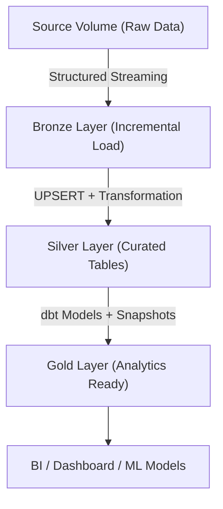

# Uber Project with dbt

This project demonstrates how to build a Data Lakehouse Medallion Architecture (Bronze, Silver, Gold Layers) on Databricks + dbt. It integrates Spark Structured Streaming, Dynamic Injection, and dbt Snapshots to achieve an end-to-end pipeline from raw sources → curated transformations → analytics-ready models.

### 📂 Project Structure

In Databricks, we first create a **Catalog (like a database)**, then define **Source, Bronze, Silver, and Gold Schemas** to store different layers of data.

```pgsql
📦 Uber-Project-with-dbt
 ┣ 📂 Source
 ┃ ┗ 📂 source_data (Volume: raw data storage)
 ┃    ┣ 📂 raw_csv/
 ┃    ┣ 📂 semi_structured/
 ┃    ┗ 📂 structured/
 ┃
 ┣ 📂 Bronze
 ┃ ┗ 📂 checkpoint_volume (store streaming `checkpoint info`)
 ┃
 ┣ 📂 Silver
 ┃ ┗ 📂 curated_tables/
 ┃
 ┗ 📂 Gold
     ┗ 📂 analytics_ready/

```

### 🥉 Bronze Layer — Ingestion with Incremental Load

1. In Source schema, create a `source_data` Volume for unstructured, semi-structured, and structured data.
2. Use Spark Structured Streaming for incremental ingestion.
   * Always define a schema instead of relying on `InferSchema`.
   * Validate schema via Batch mode, then reuse for streaming.
3. Write mode = append → new files are appended to existing tables.
4. Trigger uses `once=True` → simulates batch mode (due to Databricks free-tier limitations).
5. **Dynamic Injection**:
   * For multiple CSVs, use a loop to auto-ingest them into tables.
   * For custom schemas, use **Array + Dictionary** to store schema definitions.

--- 
### 🥈 Silver Layer — Data Transformation & UPSERT

The Silver layer performs **data cleaning and UPSERT logic**.
* A processed timestamp helps distinguish between new vs. updated records.

Example: `customers` table

1. **Extract email domain**
  * Use `split(email, '@')` to capture the domain.
2. **Normalize phone numbers**
  * Use regex to keep only numeric values.
3. **Merge names**  
  * Concatenate `first_name + last_name → full_name` and drop redundant columns.

---

### 🥇 Gold Layer — Analytics Models with dbt

In dbt, we organize models into models/silver and models/gold for cleaner design and targeted configurations via `properties.yml`.

##### dbt Design Highlights

* sources
  * Map to Databricks Source schema → used for lineage tracking.
* ref()
  * References dbt models, ensuring proper dependency management.
* unique_key
  * Required for UPSERT operations.
* snapshots
  * Implement SCD (Slowly Changing Dimension) tracking, either in `snapshots/` folder or configured in `dbt_project.yml`.

--- 

### ⚙️ Technologies

* Databricks (Delta Lake, Catalog, Volumes)

* Apache Spark (Structured Streaming, Incremental Load)

* dbt (Sources, Models, Snapshots)

* Regex-based Data Cleaning

### 📊 Data Flow


### 📝 Summary

This project illustrates a complete **Lakehouse + dbt workflow**:
* **Bronze** → Incremental ingestion of raw data

* **Silver** → Cleaning, normalization, and UPSERT logic

* **Gold** → Analytics-ready data with dbt models and SCD Snapshots

It provides a practical blueprint for integrating **Databricks + dbt** into real-world business use cases (e.g., Uber customer/driver analytics).

### Using the starter project

Try running the following commands:
- dbt run
- dbt test


### Resources:
- Learn more about dbt [in the docs](https://docs.getdbt.com/docs/introduction)
- Check out [Discourse](https://discourse.getdbt.com/) for commonly asked questions and answers
- Join the [dbt community](https://getdbt.com/community) to learn from other analytics engineers
- Find [dbt events](https://events.getdbt.com) near you
- Check out [the blog](https://blog.getdbt.com/) for the latest news on dbt's development and best practices
